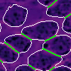

# Monolayer-Cell-Tracking

A computer vision Python package for segmenting and tracking cells in microscopy videos of confluent monolayers.

<p float="center">
  
</p>

## Table of Contents
- [Installation](#installation)
- [Features](#features)
- [Usage](#usage)
- [Additional Data](#additionalData)
- [Customization](#customization)

## Installation

Install the package using pip:

```bash
pip install monolayer-cell-tracking
```

Or install the latest version directly from GitHub:

```bash
pip install git+https://github.com/crpackard/monolayer-cell-tracking.git
```

Verify that the installation with properly working:

```bash
pytest ./tests
```

A successful test will read:

```bash
=================== test session starts ====================
platform linux -- Python 3.9.16, pytest-8.3.4, pluggy-1.5.0
rootdir: /home/cpackard/projects/monolayer-cell-tracking
configfile: pyproject.toml
collected 8 items

tests/test_01_video.py ...
tests/test_02_segmentation.py ...
```

## Features
- Automated tracking of individual cells in microscopy videos of confluent monolayers.
- Pre-trained segmentation models for fast application.
- Data visualization tools for easy interpretation.
- Quantification of physical contact with neighbors.
  - **Example:** Green line segments denote quantifiable regions of nucleus-nucleus contact between two cells.
  - <p float="center">
      
    </p>

## Usage

The cell trajectory extraction functionality of this repository is implemented by passing as input the path to a microscopy (*mp4*) video and the path to a segmentation model. For example:

```python
from monolayer_cell_tracking.trajectories import Trajectories

trajectories = Trajectories(
  src='./monolayer_cell_tracking/data/Yamada.mp4',
  model_path='./monolayer_cell_tracking/models/cellpose_segmentation_model_Yamada')

trajectories.dump_data()
```

Running this code would then create a folder ```./monolayer_cell_tracking/data/Yamada_trajectories``` filled with CSV files, each file containing the trajectory data of a single cell.

For further examples, see [/tests/](https://github.com/crpackard/monolayer-cell-tracking/tree/master/tests).

## Additional Data

This repository already contains [example data](https://github.com/crpackard/monolayer-cell-tracking/tree/master/monolayer_cell_tracking/data) of microscopy videos and their segmentations.

Additional large-file-size data can be downloaded using pre-written [scripts](https://github.com/crpackard/monolayer-cell-tracking/tree/master/scripts).

## Customization

Although many open-source segmentation libraries exist, [cellpose](https://github.com/MouseLand/cellpose) stands out for its effectiveness in segmenting cells within confluent monolayers.

This repository includes several [pre-trained segmentation models](https://github.com/crpackard/monolayer-cell-tracking/tree/master/monolayer_cell_tracking/models), but you can also train new models by following the instructions below. Fine-tuning models is straightforward, thanks to the built-in [GUI]() provided by cellpose.

### Generating Manual Segmentations

Manual segmentations for training cellpose models can be created using its GUI. To launch the GUI, run the following command:

```bash
cellpose
```

If the installation is working correctly, you should see output similar to this:

```bash
2025-01-01 17:01:43,550 [INFO] WRITING LOG OUTPUT TO /home/charles/.cellpose/run.log
2025-01-01 17:01:43,550 [INFO] 
cellpose version: 	2.2.3 
platform:       	linux 
python version: 	3.10.7 
torch version:  	2.1.1+cu121
```

This will open the cellpose GUI. For a tutorial on how to use the GUI, refer to this [video guide](https://www.youtube.com/watch?v=5qANHWoubZU).
