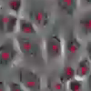
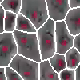
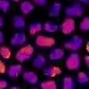
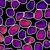

# Scripts

This folder contains scripts for the following purposes:
- Downloading example datasets, where each dataset includes:
  - [Raw video data](https://github.com/crpackard/monolayer-cell-tracking/blob/master/scripts/download_raw_data.py) of cellular monolayers.
  - [Segmentation models](https://github.com/crpackard/monolayer-cell-tracking/blob/master/scripts/download_segmentation_models.py) fine-tuned on that video data.
  - [Segmentation data](https://github.com/crpackard/monolayer-cell-tracking/blob/master/scripts/download_segmentation_data.py) that the models extract.
  - [Trajectory data](https://github.com/crpackard/monolayer-cell-tracking/blob/master/scripts/download_trajectories.py) obtained from segmentation time-series.
- Providing an example workflow for parallelizing the process of [trajectory extraction](https://github.com/crpackard/monolayer-cell-tracking/blob/master/monolayer_cell_tracking/trajectories.py) across multiple CPUs.

## Downloading Example Datasets

To showcase the capabilities of this package, I have applied it to the publicly available microscopy video datasets.

### Dataset Descriptions

- **Yamada Dataset:** Collected by the [Yamada Lab](https://www.youtube.com/watch?v=T2MWEc_rrlA), which they describe as follows: "This is a time lapse movie of MDCK epithelial cell monolayer. In tissue culture, cells may appear static, but they are constantly moving around. This collective cell movement depends on cell-to-cell interactions and demonstrates inter-connectivity of tissues. Time stamp: hr:min. The images are taken every 10 min for 10 hours."
  - Physical length and time units are measured as follows:
    - No scalebar is provided for this video, and therefore no pixel-to-micrometer conversion can be done.
    - Video description, we know that $1\text{frame}=10\text{min}$.
  - <p float="center">
        
        
    </p>
- **Pertz Dataset:** Collected by the [Pertz Lab](https://www.youtube.com/shorts/9HA9EZ9hhnw), which they describe as follows: "A movie showing waves of ERK activity triggered by apoptotic events in a MDCK epithelial monolayer in vitro. These MDCK cells are a gift of Kazuhiro Aoki and have been engineered to express the FRET biosensor EKAREV-NLS (Ref: Hino et al, Dev Cell, 2020). The time lapse movie was acquired by Paolo A Gagliardi under gentle apoptosis induction with doxorubicin and shows FRET/CFP ratio (cold colors: low ERK activity; warm colors: high ERK activity)."
  - Physical length and time units are measured as follows:
    - From the scalebar in the bottom right corner of the video it is inferred that $1\text{pixel}=0.8\mu{m}$.
    - From the time-stamp on the top right of the video, it is inferred that $1\text{frame}=0.8\mu{m}$.
  - <p float="center">
        
        
    </p>

### Download Scripts

These raw video data for the datasets can be downloaded to the [monolayer_cell_tracking/data](https://github.com/crpackard/monolayer-cell-tracking/tree/master/monolayer_cell_tracking/data) folder by running:
```bash
python3.9 download_raw_data.py
```

The pre-trained segmentation model for each dataset is downloaded to the [monolayer_cell_tracking/models](https://github.com/crpackard/monolayer-cell-tracking/tree/master/monolayer_cell_tracking/models) folder by running:
```bash
python3.9 download_segmentation_models.py
```

With the raw data and the segmentation model, the cell trajectory data can be extracted by this repository by running (from the root directory):
```bash
pytest ./tests/
```

The pre-computed segmentation and trajectory data for each dataset is available though by running:
[monolayer_cell_tracking/models](https://github.com/crpackard/monolayer-cell-tracking/tree/master/monolayer_cell_tracking/models) folder by running:
```bash
python3.9 download_segmentation_data.py
python3.9 download_trajectories.py
```

## Parallelization

The process of extracting trajectory data via [trajectories.py](https://github.com/crpackard/monolayer-cell-tracking/blob/master/monolayer_cell_tracking/trajectories.py) can be very slow (dependeing on the video frame resolution and number of cells), due to the high-cost computation of cell-cell contact points.

To speed up this process, the code has been written in a manner that can be parallelized across multiple CPUs.

As an example, the script [parallelize.py](https://github.com/crpackard/monolayer-cell-tracking/blob/master/scripts/parallelize.py) extracts the trajectory of a single cell, say, with index 1 via:
```bash
python3 parallelize.py 1
```

The script [parallelize.sh](https://github.com/crpackard/monolayer-cell-tracking/blob/master/scripts/parallelize.sh) simultaneously executes [parallelize.py](https://github.com/crpackard/monolayer-cell-tracking/blob/master/scripts/parallelize.py) across multiple CPUs.
